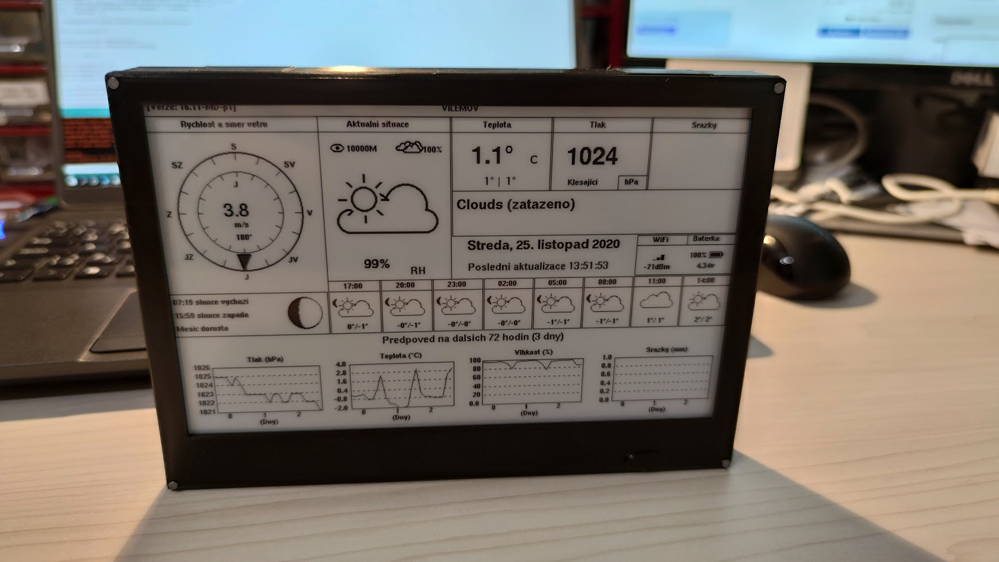
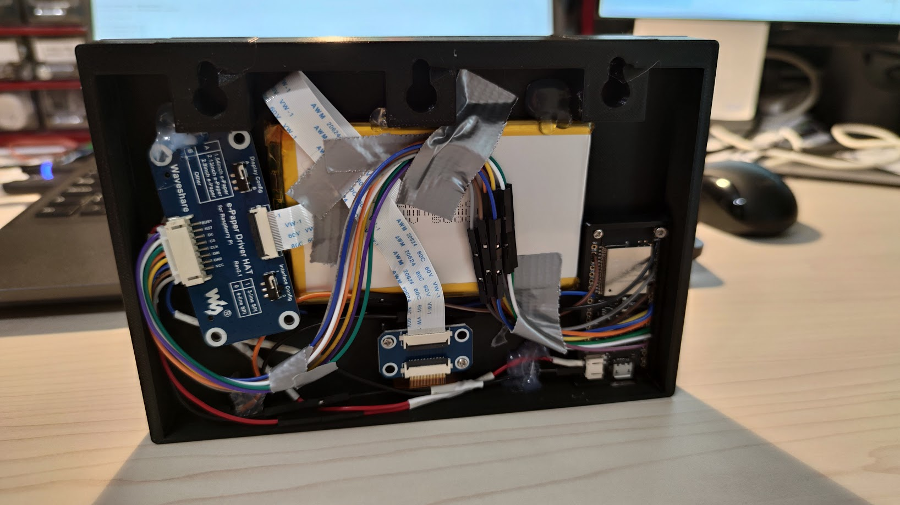
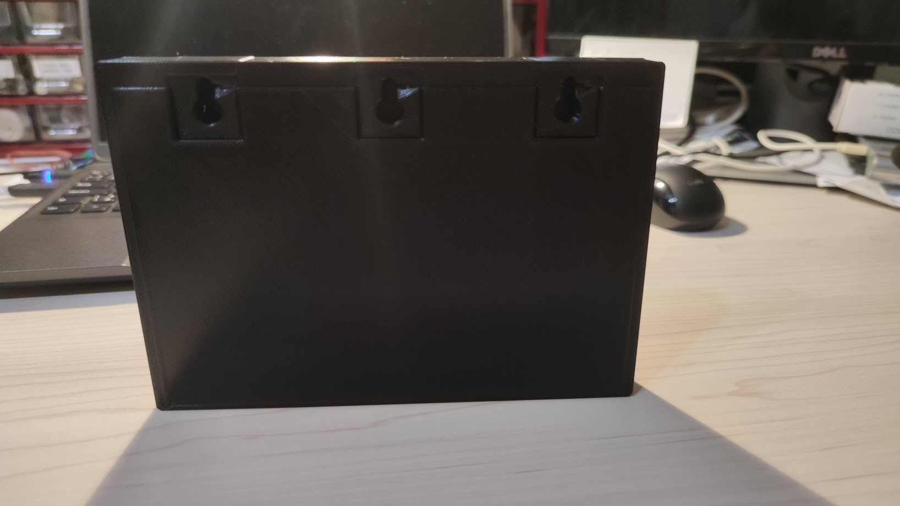

# Modification of G6EJD/ESP32-e-Paper-Weather-Display

- better Czech description
- remove of non-printable UTF-8 characters
- added Lat/Lon to OWM scraping

STLs included, derived from https://www.thingiverse.com/thing:3996613
